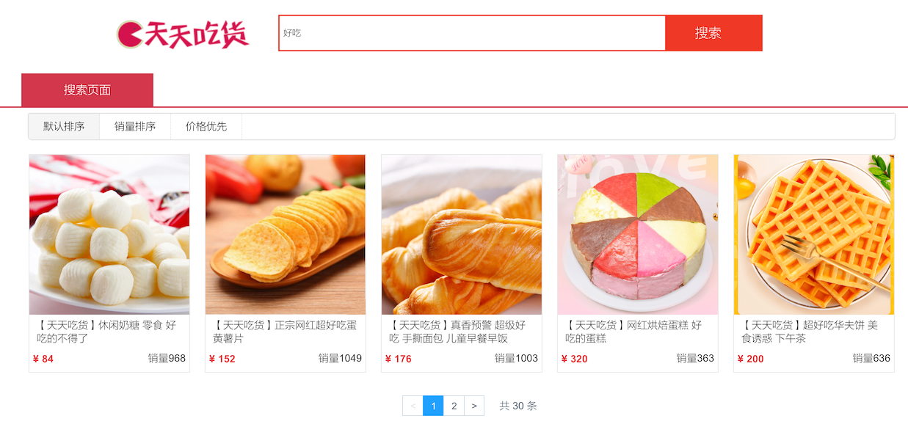

# 搜索商品

## 需求分析



- 标题模糊搜索
- 有分页查询
- 显示的商品信息有：首图、最低的规格价格、总销量、商品标题
- 有排序：默认、销量、价格

## SQL 分析

一个多表关联查询就可以了

```sql
select i.id          as itemId,
       i.item_name   as itemName,
       i.sell_counts as sellCounts,
       ii.url        as imgUrl
from items i
         left join items_img ii on i.id = ii.item_id and ii.is_main = 1;
```

查询出了商品的基本信息

| itemId | itemName | sellCounts | imgUrl |
| :--- | :--- | :--- | :--- |
| cake-1001 | 【天天吃货】真香预警 超级好吃 手撕面包 儿童早餐早饭 | 1003 | http://122.152.205.72:88/foodie/cake-1001/img1.png |
| cake-1002 | 【天天吃货】网红烘焙蛋糕 好吃的蛋糕 | 363 | http://122.152.205.72:88/foodie/cake-1002/img1.png |
| cake-1003 | 【天天吃货】超好吃华夫饼 美食诱惑 下午茶 | 636 | http://122.152.205.72:88/foodie/cake-1003/img1.png |
| bingan-1001 | 【天天吃货】彩虹马卡龙 下午茶 美眉最爱 | 396 | http://122.152.205.72:88/foodie/bingan-1001/img1.png |
| bingan-1002 | 【天天吃货】男人最爱 秋葵饼干 嘎嘣脆 | 424 | http://122.152.205.72:88/foodie/bingan-1002/img1.png |
| bingan-1003 | 【天天吃货】可爱动物饼干 儿童早餐 孩子最爱 | 868 | http://122.152.205.72:88/foodie/bingan-1003/img1.png |

现在还差一个最低价格，在商品规格表中

```sql
select item_id, min(price_discount) as price_discount
from items_spec
group by item_id;
```

这样每个商品的最低价格就拿到了

| item\_id | price\_discount |
| :--- | :--- |
| bingan-1001 | 9000 |
| bingan-1002 | 10000 |
| bingan-1003 | 8000 |

将两个 SQL 合并一下

```sql
select i.id          as        itemId,
       i.item_name   as        itemName,
       i.sell_counts as        sellCounts,
       ii.url        as        imgUrl,
       tempSpec.price_discount price
from items i
         left join items_img ii on i.id = ii.item_id and ii.is_main = 1
         left join (select item_id, min(price_discount) as price_discount
                    from items_spec
                    group by item_id) tempSpec on tempSpec.item_id = ii.item_id
```

| itemId | itemName | sellCounts | imgUrl | price |
| :--- | :--- | :--- | :--- | :--- |
| cake-1001 | 【天天吃货】真香预警 超级好吃 手撕面包 儿童早餐早饭 | 1003 | http://122.152.205.72:88/foodie/cake-1001/img1.png | 17600 |
| cake-1002 | 【天天吃货】网红烘焙蛋糕 好吃的蛋糕 | 363 | http://122.152.205.72:88/foodie/cake-1002/img1.png | 32000 |
| cake-1003 | 【天天吃货】超好吃华夫饼 美食诱惑 下午茶 | 636 | http://122.152.205.72:88/foodie/cake-1003/img1.png | 20000 |

## 商品搜索接口实现

```xml
    <select id="searchItems" parameterType="Map" resultType="cn.mrcode.foodiedev.pojo.vo.SearchItemsVO">
        select i.id          as        itemId,
               i.item_name   as        itemName,
               i.sell_counts as        sellCounts,
               ii.url        as        imgUrl,
               tempSpec.price_discount price
        from items i
                 left join items_img ii on i.id = ii.item_id and ii.is_main = 1
                 left join (select item_id, min(price_discount) as price_discount
                            from items_spec
                            group by item_id) tempSpec on tempSpec.item_id = ii.item_id
        <where>
            <if test="paramsMap.keywords != null and paramsMap.keywords != '' ">
                i.item_name like '%${paramsMap.keywords}%'
            </if>
        </where>
        order by
        <choose>
            <when test=" paramsMap.sort == &quot;c&quot;">
                i.sell_counts desc
            </when>
            <when test=" paramsMap.sort == &quot;p&quot;">
                tempSpec.price_discount asc
            </when>
            <otherwise>
                i.item_name asc
            </otherwise>
        </choose>
    </select>
<!--    k: 默认，根据 name-->
<!--    c: 根据效率排序-->
<!--    p: 根据价格排序-->
<!--    quot: 是双引号转义，使用单引号会被识别为数字类型，格式化报错，因为一个字母 char 可以识别为是数字-->
```

```java
    List<SearchItemsVO> searchItems(@Param("paramsMap") Map<String, Object> map);
```

响应类型

```java
/**
 * 用于展示商品搜索列表结果的 VO
 */
public class SearchItemsVO {

    private String itemId;
    private String itemName;
    private int sellCounts;
    private String imgUrl;
    /**
     * 价格是以分为单位，原因是因为：计算时有四舍五入，以分为单位的话，差别就不会特别大
     */
    private int price;
```

service

```java
    @Transactional(propagation = Propagation.SUPPORTS)
    @Override
    public PagedGridResult searchItems(String keywords, String sort, Integer page, Integer pageSize) {
        Map<String, Object> map = new HashMap<>();
        map.put("keywords", keywords);
        map.put("sort", sort);

        PageHelper.startPage(page, pageSize);

        List<SearchItemsVO> list = itemsMapperCustom.searchItems(map);
        return setterPagedGrid(list, page);
    }
```

controller

```java
    @ApiOperation(value = "搜索商品列表", notes = "搜索商品列表", httpMethod = "GET")
    @GetMapping("/search")
    public JSONResult search(
            @ApiParam(name = "keywords", value = "关键词", required = true)
            @RequestParam String keywords,
            @ApiParam(name = "sort", value = "排序,        " +
                    "        -- k: 默认，根据 name\n" +
                    "        -- c: 根据效率排序\n" +
                    "        -- p: 根据价格排序", required = false)
            @RequestParam String sort,
            @ApiParam(name = "page", value = "查询下一页的第几页", required = false)
            @RequestParam Integer page,
            @ApiParam(name = "pageSize", value = "分页的每一页显示的条数", required = false)
            @RequestParam Integer pageSize) {

        if (page == null) {
            page = 1;
        }

        if (pageSize == null) {
            // 继承了 BaseController 中定义的评论默认分页数量
            pageSize = COMMON_PAGE_SIZE;
        }
        PagedGridResult grid = itemService.searchItems(keywords,
                sort,
                page,
                pageSize);

        return JSONResult.ok(grid);
    }
```

## 按商品分类搜索

从首页分类跳转过来的话，是需要按分类搜索的，在跳转路径 `http://localhost:8080/foodie-shop/catItems.html?searchType=catItems&catId=37` 里面包含了两个参数：

- searchType：搜索类型，catItems 则是按分类搜索，searchItems 则是按标题搜索
- catId：分类 ID

在这里看，分类 ID 其实就在商品表中，**我们完全可以使用上面的商品搜索接口来实现**，但是你作为架构师，暴露的接口给前端使用，你就要考虑到后续的接口调用场景，因为这两个入口的场景不一样：

- 一个是在首页分类进入
- 一个是在专门的商品搜索入口

这两个场景可能在后续的业务发展中，由于业务场景的不同，他们的要求也不同，合并在一起势必会造成你的后端代码越来越复杂。**这一点你必须明确**

所以在这里，我们会分开接口提供，后端服务的查询代码也是分开提供；

需要注意的是：这里的业务设置是：**从首页跳转过来的分类搜索：不支持模糊搜索，搜索框里面触发的搜索会走文本搜索**，现在这个前端是这样实现的。

下面的代码只是针对前面的代码进行了一点点的修改

```java
    List<SearchItemsVO> searchItemsByThirdCat(@Param("paramsMap") Map<String, Object> map);
```

```xml
    <select id="searchItemsByThirdCat" parameterType="Map" resultType="cn.mrcode.foodiedev.pojo.vo.SearchItemsVO">
        select i.id          as        itemId,
        i.item_name   as        itemName,
        i.sell_counts as        sellCounts,
        ii.url        as        imgUrl,
        tempSpec.price_discount price
        from items i
        left join items_img ii on i.id = ii.item_id and ii.is_main = 1
        left join (select item_id, min(price_discount) as price_discount
        from items_spec
        group by item_id) tempSpec on tempSpec.item_id = ii.item_id
        <where>
            i.cat_id = #{catId}
        </where>
        order by
        <choose>
            <when test=" paramsMap.sort == &quot;c&quot;">
                i.sell_counts desc
            </when>
            <when test=" paramsMap.sort == &quot;p&quot;">
                tempSpec.price_discount asc
            </when>
            <otherwise>
                i.item_name asc
            </otherwise>
        </choose>
    </select>
```

```java
    @Transactional(propagation = Propagation.SUPPORTS)
    @Override
    public PagedGridResult searchItemsByThirdCat(Integer catId, String sort, Integer page, Integer pageSize) {
        Map<String, Object> map = new HashMap<>();
        map.put("catId", catId);
        map.put("sort", sort);

        PageHelper.startPage(page, pageSize);

        List<SearchItemsVO> list = itemsMapperCustom.searchItems(map);
        return setterPagedGrid(list, page);
    }
```

```java
 @ApiOperation(value = "搜索商品列表-按分类ID", notes = "按分类 ID 搜素商品列表", httpMethod = "GET")
    @GetMapping("/catItems")
    public JSONResult catItems(
            @ApiParam(name = "catId", value = "三级分类 ID", required = true)
            @RequestParam Integer catId,
            @ApiParam(name = "sort", value = "排序,        " +
                    "        -- k: 默认，根据 name\n" +
                    "        -- c: 根据效率排序\n" +
                    "        -- p: 根据价格排序", required = false)
            @RequestParam String sort,
            @ApiParam(name = "page", value = "查询下一页的第几页", required = false)
            @RequestParam Integer page,
            @ApiParam(name = "pageSize", value = "分页的每一页显示的条数", required = false)
            @RequestParam Integer pageSize) {

        if (page == null) {
            page = 1;
        }

        if (pageSize == null) {
            pageSize = COMMON_PAGE_SIZE;
        }
        PagedGridResult grid = itemService.searchItemsByThirdCat(catId,
                sort,
                page,
                pageSize);

        return JSONResult.ok(grid);
    }
```

