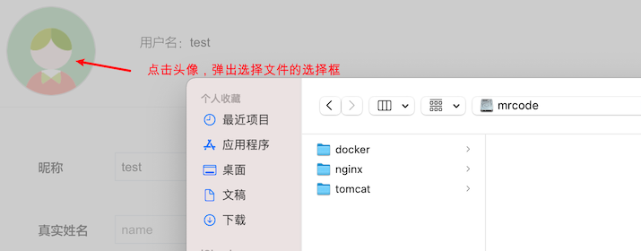

# 上传头像



前端代码这里不就贴了，后端代码处理流程讲一讲：

大体流程如下：

1. 构建固定的文件名 `face-{userid}.png`

   而文件后缀只支持 `png、jpg、jpeg` ，如果不是这些则抛出异常给前端，如果是，则从文件名中取出文件后缀，评出固定的文件名。 换句话说：一个用户最多有 3 张头像，就是上面的三个后缀

2. 构建图片存储到服务器哪一个位置的路径

   现阶段，图片保存在项目所在服务器硬盘上。

   所以以 userid 为每个用户创建一个文件夹来保存头像，`{userid}/face-{userid}.png`

    比如这个地址：`http://localhost:8088/foodie/faces/190815GTKCBSS7MW/face-190815GTKCBSS7MW.png`

   其中 `http://localhost:8088/foodie/faces/` 作为头像的公共地址。

3. 数据库中存储的是完整的图片路径，这里就使用了 spring 提供的静态资源映射功能，将静态资源映射成一个 web 服务，可以通过 url 访问到该静态资源

那么实现如下

### 图片上传接口

```java
 @ApiOperation(value = "用户头像修改", notes = "用户头像修改", httpMethod = "POST")
    @PostMapping("uploadFace")
    public JSONResult uploadFace(
            @ApiParam(name = "userId", value = "用户id", required = true)
            @RequestParam String userId,
            @ApiParam(name = "file", value = "用户头像", required = true)
                    MultipartFile file,
            HttpServletRequest request, HttpServletResponse response) {

        // .sh .php

        // 定义头像保存的地址
        //        String fileSpace = IMAGE_USER_FACE_LOCATION;
        // 通过配置文件的形式来配置，本地绝对路径  和 服务器静态资源路径
        String fileSpace = fileUpload.getImageUserFaceLocation();
        // 在路径上为每一个用户增加一个 userid，用于区分不同用户上传
        String uploadPathPrefix = File.separator + userId;

        // 开始文件上传
        if (file != null) {
            FileOutputStream fileOutputStream = null;
            try {
                // 获得文件上传的文件名称
                String fileName = file.getOriginalFilename();

                if (StringUtils.isNotBlank(fileName)) {

                    // 文件重命名  imooc-face.png -> ["imooc-face", "png"]
                    String fileNameArr[] = fileName.split("\\.");

                    // 获取文件的后缀名
                    String suffix = fileNameArr[fileNameArr.length - 1];

                    if (!suffix.equalsIgnoreCase("png") &&
                            !suffix.equalsIgnoreCase("jpg") &&
                            !suffix.equalsIgnoreCase("jpeg")) {
                        return JSONResult.errorMsg("图片格式不正确！");
                    }

                    // face-{userid}.png
                    // 文件名称重组 覆盖式上传，增量式：额外拼接当前时间
                    String newFileName = "face-" + userId + "." + suffix;

                    // 上传的头像最终保存的位置
                    String finalFacePath = fileSpace + uploadPathPrefix + File.separator + newFileName;
                    // 用于提供给 web 服务访问的地址
                    uploadPathPrefix += ("/" + newFileName);

                    File outFile = new File(finalFacePath);
                    if (outFile.getParentFile() != null) {
                        // 创建文件夹
                        outFile.getParentFile().mkdirs();
                    }

                    // 文件输出保存到目录
                    fileOutputStream = new FileOutputStream(outFile);
                    InputStream inputStream = file.getInputStream();
                    IOUtils.copy(inputStream, fileOutputStream);
                }
            } catch (IOException e) {
                e.printStackTrace();
            } finally {
                try {
                    if (fileOutputStream != null) {
                        fileOutputStream.flush();
                        fileOutputStream.close();
                    }
                } catch (IOException e) {
                    e.printStackTrace();
                }
            }

        } else {
            return JSONResult.errorMsg("文件不能为空！");
        }

        // 获取图片服务地址
        String imageServerUrl = fileUpload.getImageServerUrl();

        // 由于浏览器可能存在缓存的情况，所以在这里，我们需要加上时间戳来保证更新后的图片可以及时刷新
        String finalUserFaceUrl = imageServerUrl + uploadPathPrefix
                + "?t=" + DateUtil.getCurrentDateString(DateUtil.DATE_PATTERN);

        // 更新用户头像到数据库
        Users userResult = centerUserService.updateUserFace(userId, finalUserFaceUrl);

        userResult = setNullProperty(userResult);
        CookieUtils.setCookie(request, response, "user",
                JsonUtils.objectToJson(userResult), true);

        // TODO 后续要改，增加令牌token，会整合进redis，分布式会话

        return JSONResult.ok();
    }
```

service

```java
 @ApiOperation(value = "用户头像修改", notes = "用户头像修改", httpMethod = "POST")
    @PostMapping("uploadFace")
    public JSONResult uploadFace(
            @ApiParam(name = "userId", value = "用户id", required = true)
            @RequestParam String userId,
            @ApiParam(name = "file", value = "用户头像", required = true)
                    MultipartFile file,
            HttpServletRequest request, HttpServletResponse response) {

        // .sh .php

        // 定义头像保存的地址
        //        String fileSpace = IMAGE_USER_FACE_LOCATION;
        // 通过配置文件的形式来配置，本地绝对路径  和 服务器静态资源路径
        String fileSpace = fileUpload.getImageUserFaceLocation();
        // 在路径上为每一个用户增加一个 userid，用于区分不同用户上传
        String uploadPathPrefix = File.separator + userId;

        // 开始文件上传
        if (file != null) {
            FileOutputStream fileOutputStream = null;
            try {
                // 获得文件上传的文件名称
                String fileName = file.getOriginalFilename();

                if (StringUtils.isNotBlank(fileName)) {

                    // 文件重命名  imooc-face.png -> ["imooc-face", "png"]
                    String fileNameArr[] = fileName.split("\\.");

                    // 获取文件的后缀名
                    String suffix = fileNameArr[fileNameArr.length - 1];

                    if (!suffix.equalsIgnoreCase("png") &&
                            !suffix.equalsIgnoreCase("jpg") &&
                            !suffix.equalsIgnoreCase("jpeg")) {
                        return JSONResult.errorMsg("图片格式不正确！");
                    }

                    // face-{userid}.png
                    // 文件名称重组 覆盖式上传，增量式：额外拼接当前时间
                    String newFileName = "face-" + userId + "." + suffix;

                    // 上传的头像最终保存的位置
                    String finalFacePath = fileSpace + uploadPathPrefix + File.separator + newFileName;
                    // 用于提供给 web 服务访问的地址
                    uploadPathPrefix += ("/" + newFileName);

                    File outFile = new File(finalFacePath);
                    if (outFile.getParentFile() != null) {
                        // 创建文件夹
                        outFile.getParentFile().mkdirs();
                    }

                    // 文件输出保存到目录
                    fileOutputStream = new FileOutputStream(outFile);
                    InputStream inputStream = file.getInputStream();
                    IOUtils.copy(inputStream, fileOutputStream);
                }
            } catch (IOException e) {
                e.printStackTrace();
            } finally {
                try {
                    if (fileOutputStream != null) {
                        fileOutputStream.flush();
                        fileOutputStream.close();
                    }
                } catch (IOException e) {
                    e.printStackTrace();
                }
            }

        } else {
            return JSONResult.errorMsg("文件不能为空！");
        }

        // 获取图片服务地址
        String imageServerUrl = fileUpload.getImageServerUrl();

        // 由于浏览器可能存在缓存的情况，所以在这里，我们需要加上时间戳来保证更新后的图片可以及时刷新
        String finalUserFaceUrl = imageServerUrl + uploadPathPrefix
                + "?t=" + DateUtil.getCurrentDateString(DateUtil.DATE_PATTERN);

        // 更新用户头像到数据库
        Users userResult = centerUserService.updateUserFace(userId, finalUserFaceUrl);

        userResult = setNullProperty(userResult);
        CookieUtils.setCookie(request, response, "user",
                JsonUtils.objectToJson(userResult), true);

        // TODO 后续要改，增加令牌token，会整合进redis，分布式会话

        return JSONResult.ok();
    }
```

后面分别说：fileUpload 这个配置类  和 静态资源映射

数据库中存储的是 web 服务的头像地址，这样做的好处是，后续使用图片存储、文件存储中间件或则服务器时，就可以兼容了，不用修改过多的代码

##  属性资源文件

fileUpload 类实现如下

```java
package cn.mrcode.foodiedev.resource;

import org.springframework.boot.context.properties.ConfigurationProperties;
import org.springframework.context.annotation.PropertySource;
import org.springframework.stereotype.Component;

@Component
@ConfigurationProperties(prefix = "file")
@PropertySource("classpath:file-upload-prod.properties")
public class FileUpload {

    private String imageUserFaceLocation;
    private String imageServerUrl;

    public String getImageServerUrl() {
        return imageServerUrl;
    }

    public void setImageServerUrl(String imageServerUrl) {
        this.imageServerUrl = imageServerUrl;
    }

    public String getImageUserFaceLocation() {
        return imageUserFaceLocation;
    }

    public void setImageUserFaceLocation(String imageUserFaceLocation) {
        this.imageUserFaceLocation = imageUserFaceLocation;
    }
}

```

classpath 文件内容如下

```java
file.imageUserFaceLocation=/workspaces/images/foodie/faces
file.imageServerUrl=http://localhost:8088/foodie/faces
```

可以看到在这里 `@PropertySource("classpath:file-upload-prod.properties")` 绑定死了文件名称，在不同环境之间切换是个麻烦事情

所以笔者并不推荐这样使用，直接使用 boot 的环境配置文件不是更好？

## 静态资源映射

```java
@Configuration
public class WebMvcConfig implements WebMvcConfigurer {
    // 实现静态资源的映射
    @Override
    public void addResourceHandlers(ResourceHandlerRegistry registry) {
        registry.addResourceHandler("/**")
                // 这里拦截之后，之前能访问的 swagger2 文档就无法访问到了
                // 因为它也是第三方 jar 包提供的 html 静态文件，所以这里也需要映射下
                .addResourceLocations("classpath:/META-INF/resources/")  // 映射 swagger2
                .addResourceLocations("file:/workspaces/images/");  // 映射本地静态资源
    }
```

上传后的图片可以通过如下地址访问到

```java
http://localhost:8088/foodie/faces/190815GTKCBSS7MW/face-190815GTKCBSS7MW.png
```

## 限制图片格式以防后门

```java
if (!suffix.equalsIgnoreCase("png") &&
    !suffix.equalsIgnoreCase("jpg") &&
    !suffix.equalsIgnoreCase("jpeg")) {
  return JSONResult.errorMsg("图片格式不正确！");
}
```

前端限制了能选择的图片类型，但是后端如果不限制的话，就有可能导致上传不是图片的文件，这个就是一个小漏洞。

