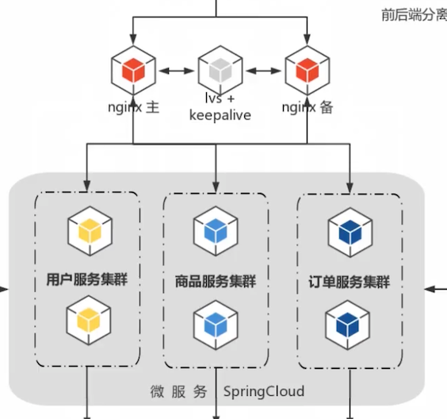
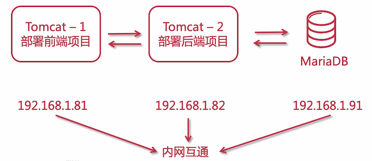

# 云服务器购买及安装配置(JDK/Tomcat/MariaDB)

## 前置必备

- 云服务器 或 本地虚拟机

  部署项目，如果有云服务器则用云服务器，没有则可以使用本地虚拟机来部署，充当线上环境
  
- Linux 系统基础

  你需要懂一些 Linux 的基础知识

- 内网互通

  因为需要安装多台虚拟机，所以需要这些虚拟机内网互通

  

## 云服务器购买建议

这里以 [腾讯云服务器](buy.cloud.tencent.com) 举例说明


需要注意的有如下项（这些每个云服务器厂商购买页面都有说明），特别注意的是一些通用概念：

- 地域

  腾讯云云服务器托管机房分布在全球多个位置，由不同的地域（region）构成。每个地域（region）都指一个独立的物理数据中心，不同地域间的云服务器内网不互通。

  服务器购买后，不能更换区域，除非重新购买服务器

- 可用区

  每个地域内都有多个物理上相互隔离的位置，称为可用区（zone）。每个可用区都是独立的，同一地域下的可用区通过低时延的内网链路相连。同一地域下的不同可用区间的云服务器可以通过内网互相访问

- 网络

  默认为私有网络/子网，购买服务器后，可以去新建私有网络或子网

- 实例

  重要的就是选择 CPU 核数，一般 16 核、32G 服务器就很不错了，根据需要选择

  它的 CPU 高低还和内网带宽绑定，这个挑选时需要注意

- 镜像

  也就是选择服务器系统，一般选择  CentOS 64 位 7.x 以上了

- 系统盘

  可选 SSD 和高性能普通盘，需要注意的是，系统盘选定后不能更换介质，大小也无法变更，只能通过挂载其他盘的方式来扩充

- 公网带宽

  可选免费分配独立公网 IP

  云服务器需要外网访问能力的时候，需要为云服务器分配公网 IP，如果云服务器不分配公网 IP，不支持外出流量，并且无法使用外网 IP 对外进行互相通信。

- 公共网关

  视频中选购的时候有该选项，笔者购买的时候没有看到

  

  它的作用是这样的，说如果不绑定公共网关，该服务器是不能访问外网的，比如用户服务器调用第三方 API 接口，无法调用，只有通过 nginx 主/备这两台作为公共网关的机器去访问。

  笔者对网络这一块不太熟悉，所以没有太明白其中的含义。


- 安全组

  可以配置入站规则和出站规则

  入站：允许哪些来源的 IP 和端口访问我们的服务器

  出站：允许我们的服务器可以访问哪些网络上的 IP 和 端口，只有这里允许了的，才可以访问出去，否则将不能访问到外网环境

- 其他的，就没有那么重要了

## 安装 JDK

购买云服务器后，厂商会提供一个公网 IP 和内网 IP，我们需要使用 SSH 工具连接到云服务器，随后就能在命令行中操作 linux 系统。

- 公网 IP：39.106.215.59

- 内网 IP：172.17.41.6

若在本地虚拟机中操作 linux，只需要配置静态 IP 即可，比如：192.168.1.88

推荐使用 SecureCRT 工具来链接 SSH，它在 windows 和 mac 上都可以使用

### 检查是否安装 JDK

服务器安装 JDK 之前，先确保有没有默认安装 JDK，执行以下命令进行检查：

```java
java -version
openjdk version "1.8.0_222-ea"
OpenJDK Runtime Environment (build 1.8.0_222-ea-b03)
OpenJDK 64-Bit Server VM (build 25.222-b03, mixed mode)
```

如果需要卸载，卸载步骤如下：

### 卸载

检查系统安装的 OpenJDK

```bash
rpm -qa | grep openJdk -i
java-1.8.0-openjdk-headless-1.8.0.222.b03-1.el7.x86_64
java-1.8.0-openjdk-1.8.0.222.b03-1.el7.x86_64
```

删除以上 2 项的安装包并且，再次检查是否删除完成

```bash
# 删除
rpm -e --nodeps java-1.8.0-openjdk-headless-1.8.0.222.b03-1.el7.x86_64
rpm -e --nodeps java-1.8.0-openjdk-1.8.0.222.b03-1.el7.x86_64

# 再次查看
rpm -qa | grep openJdk -i
```

### 安装

```bash
# 创建目录，该目录用来存放 jdk
mkdir /usr/java
# 创建专门用来存放软件的临时目录
mkdir /home/software
# 通过 ftp 工具将我们本地下载好的 jdk tar.gz 的包上传到该目录下
# 解压 jdk 压缩包
tar -zxvf jdk-8u9191-linux-x64.tar.gz
# 移动解压后的包到  /usr/java 
mv jdk1.8.0_191/ /usr/java
```

添加环境变量

```bash
# 修改 profile 文件
vim /etc/profile

# 配置 jdk 环境变量
export JAVA_HOME=/usr/java/jdk1.8.0_191
export PATH=$PATH:$JAVA_HOME/bin

# 刷新 profile 文件，让环境变量生效
source /etc/profile
```

## 安装 Tomcat

### 部署方案



这里会使用 3 台服务器：

- tomcat-1 用来部署前端项目，后续会使用 nginx 来代替
- tomcat-2 用来部署后端项目
- mariaDB 数据库

他们三台服务器一定要在同一个局域网中，并且互通

## 安装 MariaDB