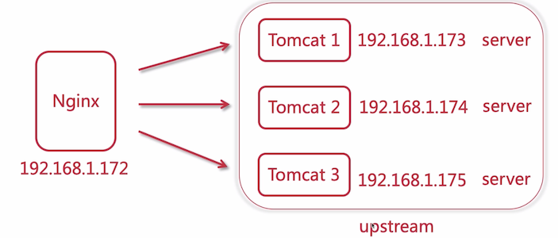

# Nginx 构建 Tomcat 集群

在前面是在介绍 Nginx 的用法和基础知识，现在我们要来构建业务集群了



笔者这里的分布如下：

- Nginx：192.168.56.105
- Tomcat1：192.168.56.106
- Tomcat2：192.168.56.107
- Tomcat3：192.168.56.108

这里，我们在原来的 my.conf 中来编写配置文件

```lua
# 配置上游服务器,名称是自定义的
upstream tomcats {
   server 192.168.56.106:8080;
   server 192.168.56.107:8080;
   server 192.168.56.108:8080;
}

server {
   listen       80;
   server_name  www.tomcats.com;

   location / {
      proxy_pass    http://tomcats;
   }
}
```

不要忘记增加 hosts 配置

```
# tomcat 集群
192.168.56.105 www.tomcats.com
```

访问 `http://www.tomcats.com/` 就能访问到集群了

注：proxy_pass 指令后面可以直接写目标地址，这个和 upstream 中只有一个 server 效果是一样的

## 负载均衡策略

### 轮询

Nginx 搭建的 upstream 默认策略是 **轮询**，就是一个 server 依次处理一个请求

这种情况下适合每个 server 的硬件配置是一样的（处理能力是一样的）

如何验证呢？现在 3 个 tomcat 的默认首页都是一样的，我们需要 更改它的默认首页信息，才能验证当前访问的到底是哪一个 server

```bash
# 每个 tomcat 都更改该文件的内容
vim /usr/local/tomcat-api/webapps/ROOT/index.jsp 

# 在 body 标签下面增加一行代码，标识当前是哪一个 tomcat
<body>
 <p>tomcat1</p>
 ...
```

每次刷新都会是不同的 tomcat 被访问到

### 加权轮询


如上图所示，根据每个工人的身体素质，分配不同的任务。

在 nginx 中使用 `weight` 关键字来指定

```
upstream tomcats {
   server 192.168.56.106:8080    weight=1;
   server 192.168.56.107:8080    weight=2;
   server 192.168.56.108:8080    weight=3;
}
```

这个测试的话，不太明显的能看出来，但是在不断的刷新中，能明显的感觉到 `weight=3` 的出现几率较大

## upstream 指令参数
::: tip
本章内容可以在官方文档 [ngx_stream_upstream_module](http://nginx.org/en/docs/stream/ngx_stream_upstream_module.html) 找到

要记得：nginx 是由多个模块组合起来的，我们在配置的时候其实就是在针对他的模块配置，所以只要找对应的模块即可
:::

下面介绍几个常用的参数

- max_conns

- slow_start

- down

- backup

- max_fails

- fail_timeout

### max_conns

限制链接到 server 的最大连接数

需要注意的是：

- 如果配置了多个 work 进程，则需要共享配置，链接总数就有可能会超过 max_conns 的限制，这里说需要定义在共享内存中，这个也是一个语法，文档中有描述；但是文档中大概意思是说：如果没有定义共享内存，那么这个限制会在每个 worker 进程中独享配置
- 老版本中没有该参数，原来是给商业版本使用的，在新版本就可以使用了

如下配置

```lua
# 配置上游服务器,名称是自定义的
upstream tomcats {
   server 192.168.56.106:8080    max_conns=1;
   server 192.168.56.107:8080    max_conns=2;
   server 192.168.56.108:8080    max_conns=3;
}
```

当达到最大链接数量时，新增的链接会被拒绝掉，响应 `502 状态，Bad Gateway` 信息，这个可以通过 JMeter 来进行测试